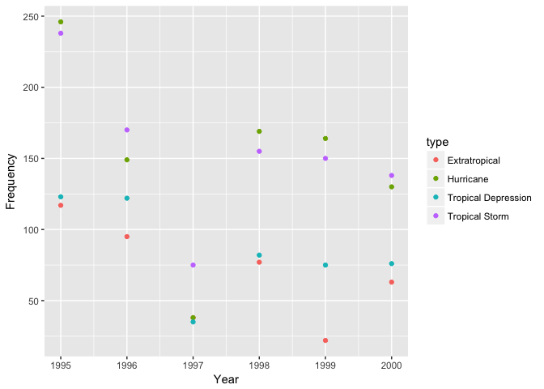
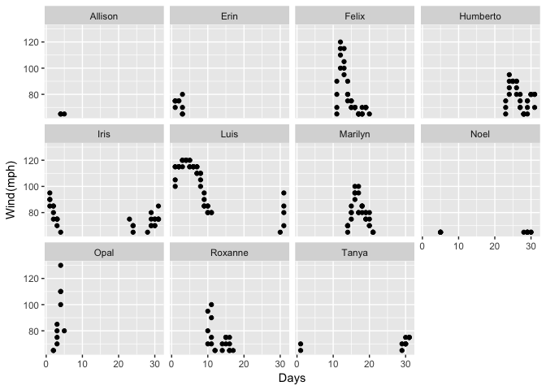

Today we are going to complete my own task of plotting storms from the
nasaweather package based on the different catagories.

    library(tidyr)

    ## Warning: package 'tidyr' was built under R version 3.3.2

    library(ggplot2)

    ## Warning: package 'ggplot2' was built under R version 3.3.2

    library(dplyr)

    ## 
    ## Attaching package: 'dplyr'

    ## The following objects are masked from 'package:stats':
    ## 
    ##     filter, lag

    ## The following objects are masked from 'package:base':
    ## 
    ##     intersect, setdiff, setequal, union

    #install.packages("nasaweather")
    library(nasaweather)

    storms <- nasaweather::storms

    storms %>%
      group_by(year, type) %>%
      count() %>%
      ggplot(aes(x=year, y=n, color=type)) +
        geom_point()+
        labs(x="Year", y="Frequency")

 Looking
at the year with the most storms, which storm was the most desistating?

    library(tidyr)
    library(ggplot2)
    library(dplyr)

    storms %>%
      filter(year=="1995", type=="Hurricane")%>%
      ggplot(aes(x=day, y=wind, group = "name"))+
      geom_point()+
      facet_wrap("name")+
      labs(x="Days", y="Wind(mph)")

    #Find out what day of what month was the most vicious hurricane during Hurricane Felix's reign. 

    #Felix <- storms %>%
    #  filter(name=="Fleix")
