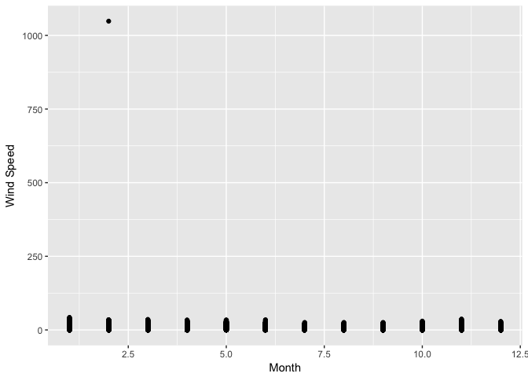
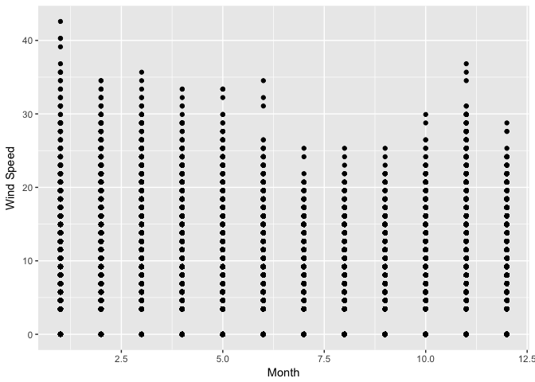
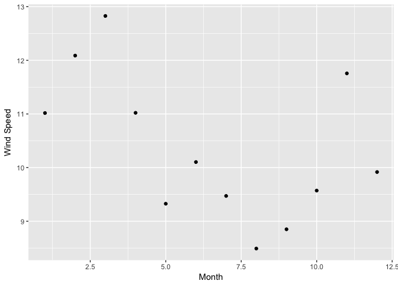
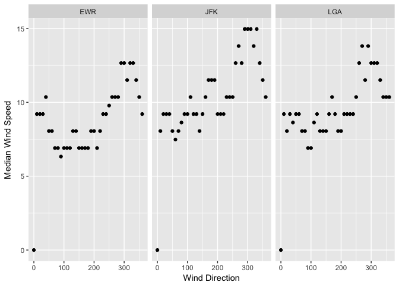
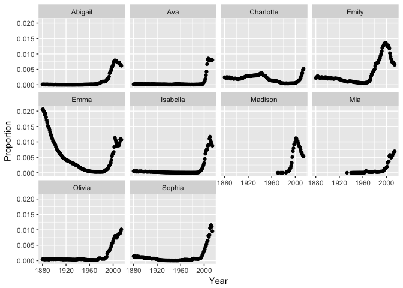
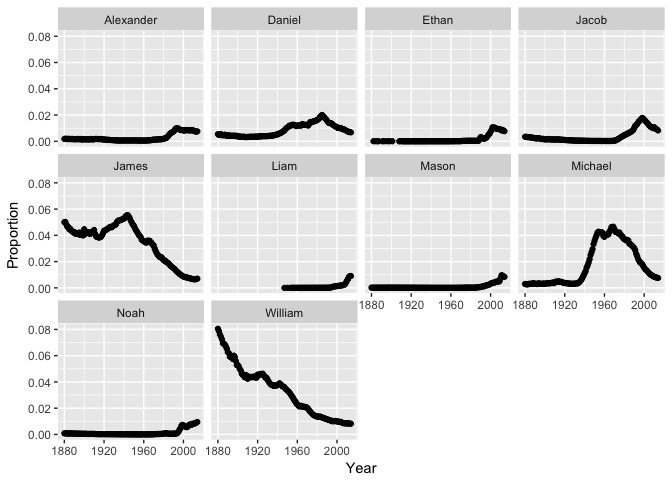

    library(dplyr)

    ## 
    ## Attaching package: 'dplyr'

    ## The following objects are masked from 'package:stats':
    ## 
    ##     filter, lag

    ## The following objects are masked from 'package:base':
    ## 
    ##     intersect, setdiff, setequal, union

    library(tidyr)

    ## Warning: package 'tidyr' was built under R version 3.3.2

    library(ggplot2)

    ## Warning: package 'ggplot2' was built under R version 3.3.2

    # install.packages("nycflights13")
    library(nycflights13)

    ## Warning: package 'nycflights13' was built under R version 3.3.2

    #Using Nycflights dataframe we are analyzing wind speed throughout the 2013 year.
    nycflights13::weather

    ## # A tibble: 26,130 × 15
    ##    origin  year month   day  hour  temp  dewp humid wind_dir wind_speed
    ##     <chr> <dbl> <dbl> <int> <int> <dbl> <dbl> <dbl>    <dbl>      <dbl>
    ## 1     EWR  2013     1     1     0 37.04 21.92 53.97      230   10.35702
    ## 2     EWR  2013     1     1     1 37.04 21.92 53.97      230   13.80936
    ## 3     EWR  2013     1     1     2 37.94 21.92 52.09      230   12.65858
    ## 4     EWR  2013     1     1     3 37.94 23.00 54.51      230   13.80936
    ## 5     EWR  2013     1     1     4 37.94 24.08 57.04      240   14.96014
    ## 6     EWR  2013     1     1     6 39.02 26.06 59.37      270   10.35702
    ## 7     EWR  2013     1     1     7 39.02 26.96 61.63      250    8.05546
    ## 8     EWR  2013     1     1     8 39.02 28.04 64.43      240   11.50780
    ## 9     EWR  2013     1     1     9 39.92 28.04 62.21      250   12.65858
    ## 10    EWR  2013     1     1    10 39.02 28.04 64.43      260   12.65858
    ## # ... with 26,120 more rows, and 5 more variables: wind_gust <dbl>,
    ## #   precip <dbl>, pressure <dbl>, visib <dbl>, time_hour <dttm>

    coll <- c(1:4, 10:11)
    wind <- nycflights13::weather[,coll]

    #Plot frame to view any outliers, there seems to be an outlier
    ggplot(wind, aes(x=month, y=wind_speed, na.rm=TRUE))+
      geom_point()+
      labs(x = "Month", y = "Wind Speed")

    ## Warning: Removed 3 rows containing missing values (geom_point).

    #Get rid of the outlier wind speed
    wind <- wind %>% 
      filter(wind_speed < 250)

    #plot wind speed by month without the outlier
    ggplot(wind, aes(x=month, y=wind_speed, group=month))+
      geom_point()+
      labs(x= "Month", y="Wind Speed")

    #average wind speed per month for 2013
    wind %>%
      group_by(month) %>%
      summarise(avg.wind = mean(wind_speed)) %>%
      ggplot(aes(x=month, y=avg.wind, group = month)) +
        geom_point() +
        labs(x="Month", y="Wind Speed")

 The
second part of using weather in nycflights is to see the meadian speed
at each airport. Make a table and a plot of median wind speed by
direction, for each airport. (Can use coord\_polar())

    library(dplyr)
    library(tidyr)
    library(ggplot2)

    #Filter out the NA values for wind direction and use the columns that will be of use.
    nycflights13::weather

    ## # A tibble: 26,130 × 15
    ##    origin  year month   day  hour  temp  dewp humid wind_dir wind_speed
    ##     <chr> <dbl> <dbl> <int> <int> <dbl> <dbl> <dbl>    <dbl>      <dbl>
    ## 1     EWR  2013     1     1     0 37.04 21.92 53.97      230   10.35702
    ## 2     EWR  2013     1     1     1 37.04 21.92 53.97      230   13.80936
    ## 3     EWR  2013     1     1     2 37.94 21.92 52.09      230   12.65858
    ## 4     EWR  2013     1     1     3 37.94 23.00 54.51      230   13.80936
    ## 5     EWR  2013     1     1     4 37.94 24.08 57.04      240   14.96014
    ## 6     EWR  2013     1     1     6 39.02 26.06 59.37      270   10.35702
    ## 7     EWR  2013     1     1     7 39.02 26.96 61.63      250    8.05546
    ## 8     EWR  2013     1     1     8 39.02 28.04 64.43      240   11.50780
    ## 9     EWR  2013     1     1     9 39.92 28.04 62.21      250   12.65858
    ## 10    EWR  2013     1     1    10 39.02 28.04 64.43      260   12.65858
    ## # ... with 26,120 more rows, and 5 more variables: wind_gust <dbl>,
    ## #   precip <dbl>, pressure <dbl>, visib <dbl>, time_hour <dttm>

    cols <- c(1:4, 9:10)
    direction <- nycflights13::weather[,cols]
    valuedirection <- filter(direction, !is.na(wind_dir))

    #grouping by the airport and the wind direction and calculating the med wind speed by origin.
    directiongroup <- valuedirection %>%
      group_by(origin, wind_dir) %>%
      summarize(median.speed = median(wind_speed)) %>%
      .[order(.$origin),]
      
     #final plot of wind direction by wind speed and origin.
     ggplot(directiongroup, aes(x=wind_dir, y=median.speed, group=origin)) +
      geom_point()+
       facet_wrap(~origin)+
       labs(x="Wind Direction", y="Median Wind Speed")

Hurray !! Now we use nycflights13::flights and nycflights13::airlines:
Make a table with two columns: airline name (not carrier code) and
median distance flown from JFK airport. The table should be arranged in
order of decreasing mean flight distance. Hint: use a \_join function to
join flights and airlines. Make a wide-format data frame that displays
the number of flights that leave Newark ("EWR") airport each month, from
each airline

    library(dplyr)
    library(tidyr)
    library(ggplot2)

    col <- c(10, 13:14, 16)
    flightsdist <- nycflights13::flights[,col] %>%
     filter(., origin == "JFK") %>%
      group_by(carrier)%>%
      summarize(med.dist = median(distance))

    total.med.dist.carrier <- left_join(nycflights13::airlines, flightsdist, by="carrier") %>%
      filter(., !is.na(med.dist))

    #Final Table for the median distance for each carrier leaving JFK
    final.dis.table <- total.med.dist.carrier[,2:3]

Make a wide-format data frame that displays the number of flights that
leave Newark ("EWR") airport each month, from each airline

    #Want origin to be EWR, need month and carrier.

    col <- c(2, 10, 13)
    flightsEWR <- nycflights13::flights[,col] %>%
     filter(., origin == "EWR") %>%
      group_by(carrier, month) %>%
      summarize(Number = n()) %>%
      spread(month, Number)

Now we move on to babynames! Identify the ten most common male and
female names in 2014. Make a plot of their frequency (prop) since 1880.
(This may require two separate piped statements). Make a single table of
the 26th through 29th most common girls names in the year 1896, 1942,
and 2016 Write task that involves some of the functions on the Data
Wrangling Cheat Sheet and execute it. You may either use your own data
or data packages (e.g., the ones listed here).

    #install.packages("babynames")

    babynames::babynames 

    ## # A tibble: 1,825,433 × 5
    ##     year   sex      name     n       prop
    ##    <dbl> <chr>     <chr> <int>      <dbl>
    ## 1   1880     F      Mary  7065 0.07238359
    ## 2   1880     F      Anna  2604 0.02667896
    ## 3   1880     F      Emma  2003 0.02052149
    ## 4   1880     F Elizabeth  1939 0.01986579
    ## 5   1880     F    Minnie  1746 0.01788843
    ## 6   1880     F  Margaret  1578 0.01616720
    ## 7   1880     F       Ida  1472 0.01508119
    ## 8   1880     F     Alice  1414 0.01448696
    ## 9   1880     F    Bertha  1320 0.01352390
    ## 10  1880     F     Sarah  1288 0.01319605
    ## # ... with 1,825,423 more rows

    Girls <- babynames::babynames %>%
      filter(sex == "F", year == "2014")%>%
      top_n(10)%>%
      select(name) %>%
      left_join(babynames::babynames, by = "name") %>%
      filter(sex == "F")%>%
      ggplot(aes(x=year, y=prop))+
      geom_point()+
      facet_wrap("name")+
      labs(x="Year", y="Proportion")

    ## Selecting by prop

    print(Girls)

    Boys <- babynames::babynames %>%
      filter(sex == "M", year == "2014")%>%
      top_n(10)%>%
      select(name) %>%
      left_join(babynames::babynames, by = "name")%>%
      filter(sex == "M")%>%
      ggplot(aes(x=year, y=prop))+
      geom_point()+
      facet_wrap("name")+
      labs(x="Year", y="Proportion")

    ## Selecting by prop

      print(Boys)

      #Make a single table of the 26th through 29th most common girls names in the year 1896, 1942, and 2016 (Except there isnt 2016 data ....)
      
      Girl26.29 <- babynames::babynames %>%
        filter(sex=="F", year=="1896"|year=="1942"|year=="2016")%>%
        group_by(year)%>%
       top_n(29, prop)  %>%
       top_n(-4, prop) %>%
        print()

    ## Source: local data frame [8 x 5]
    ## Groups: year [2]
    ## 
    ##    year   sex    name     n        prop
    ##   <dbl> <chr>   <chr> <int>       <dbl>
    ## 1  1896     F  Martha  2022 0.008023969
    ## 2  1896     F  Esther  1964 0.007793805
    ## 3  1896     F Frances  1964 0.007793805
    ## 4  1896     F   Edith  1932 0.007666819
    ## 5  1942     F   Helen 10014 0.007202575
    ## 6  1942     F Marilyn  9904 0.007123458
    ## 7  1942     F   Diane  9550 0.006868843
    ## 8  1942     F  Martha  9513 0.006842231
