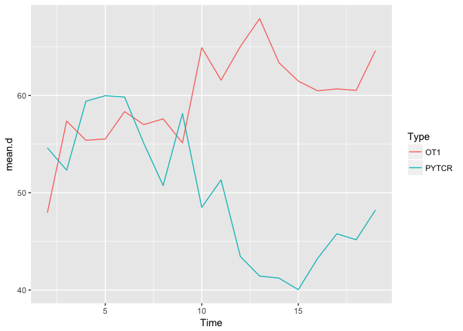
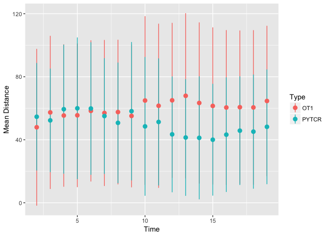
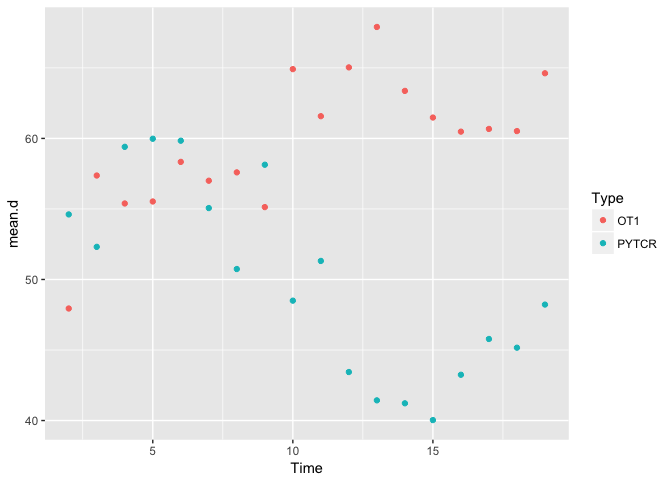

TCell Interation and Proximity to an Infected Hepatocyte; Analysis of
attraction between specific and nonspecific Tcells.

Introduction
============

T cells are the body's line of defense against a roaming infection and
can be the reason that an infection persists or is eliminated without
even a sneeze. For malaria, Tcells are our only weapons to fight this
ruthless infection. Malaria is a parasite that enters the organism's
body by way of an injection or a transfer of bodily fluids with an
infected person. Once malaria has entered the body it hijacks blood
cells and enventually makes its way to the liver. The liver is the area
of the body that the parasite will replicate and then be poised to
infect other organs. The T cells that are roaming around in the liver
have the chance to hinder the infection from spreading and research is
ongoing to determine if a specific T cell is, in anyway, attracted to
its target cell.

Methods
=======

This project is a joint project between Dr. Ian Cockburn and others at
University of Tennessee. The goal of this project is to assess the
attraction of a specilized T cell towards an infected target cell. In
order to test this, mice were infected with malaria and allowed to
incubate until liver stage malaria was garunteed. After 20 hours, malria
specific t cells (PYTCR) and chicken albumin T cells (OT1) were GPF
labeled and injected into the mouse liver. After 48 hours, the mice were
exposed to a confocal spining disc microscope and the 3D positions of
the GFP labeled Tcells and malaria cell was tracked for one hour. There
were 11 specific cells, 17 nonspecific cells and one parasitic infected
hepatocyte. The three dimentional distance at each of the 18 time points
was calculated with the Ecludian distance formula.

Parameters
----------

There were 11 labeled malaria specific, PYTCR, that were included in
this study, and 17 malaria nonspecific chicken albumin OT1 T cells. The
calculations completed were done between each of the Tcell's three
dimentional location at each of the 18 time steps and the difference to
the parasite's location. The time inbetween the time steps is two
minutes each, and the whole tracking was a litle under an hour. The
parasite was moving minorly throught the tracking process, but the
recorded three dimentional position was used in the calculations.

Results
=======

    library(readr)
    Allcells <- read_csv("../data/Allcells.csv")

    ## Parsed with column specification:
    ## cols(
    ##   `Position X` = col_double(),
    ##   `Position Y` = col_double(),
    ##   `Position Z` = col_double(),
    ##   Unit = col_character(),
    ##   Time = col_integer(),
    ##   Parent = col_integer(),
    ##   ID = col_integer(),
    ##   NUMBER = col_integer(),
    ##   Type = col_character()
    ## )

    library(dplyr)

    ## 
    ## Attaching package: 'dplyr'

    ## The following objects are masked from 'package:stats':
    ## 
    ##     filter, lag

    ## The following objects are masked from 'package:base':
    ## 
    ##     intersect, setdiff, setequal, union

    library(ggplot2)

    # Example of how to use dplyr

    # Group the data frame (actually a "tibble") by time, parent, and type
    Allcells <- group_by(Allcells, Type, Parent, Time)

    # Get legal names
    names(Allcells)[1:3] <- c("x", "y", "z")

    my_summ <- summarise(Allcells, 
              mean.x=mean(x),
              sd.x=sd(x))

    # Drop the timepoint 1 (in two redundant ways)
    Allcells_t2 <- Allcells[Allcells$Time !=1, ]
    Allcells_t2 <- filter(Allcells, Time !=1)

    # Create a data frame of just tcells with x,y,z, time, parent and type. 
    tcells <- filter(Allcells, Type != "Parasite")
    cols <- c(1:3, 5:6, 9)
    tcells <- tcells[,cols]

    # The old-school way
    parasite <- filter(Allcells, Type == "Parasite")
    names(parasite)[1:3] <- c("p.x", "p.y", "p.z")
    parasite <- ungroup(parasite)
    parasite <- select(parasite, Time, p.x, p.y, p.z)

    merged_data <- left_join(tcells, parasite, by="Time") %>%
      mutate(distance = sqrt((p.x-x)^2 + (p.y-y)^2 + (p.z-z)^2)) %>%
      group_by(Time, Type) %>%
      summarise(mean.d=mean(distance),sd.d=sd(distance))

    #ggplot(merged_data, aes(x=Time, y=mean.d, colour=Type)) +
     # geom_line(aes(group=Parent)) +
      #facet_wrap(~Type)

    #merged_data <- left_join(tcells, parasite, by="Time") %>%
     # mutate(distance = sqrt((p.x - x)^2 + (p.y - y)^2 + (p.z - z)^2)) %>%
    #  group_by(Time, Type) 

    ## This graph doesnt say much
    ggplot(merged_data, aes(x=Time, y=mean.d,  colour=Type)) +
      geom_line(aes(group=Type)) 

    #summ_data <- merged_data %>%
    #group_by(Time, Type) %>%
     # summarise(merged_data, mean.distance = mean(distance, na.rm=TRUE),
      #          sd.distance = sd(distance, na.rm=TRUE)) 

    ggplot(merged_data, aes(x=Time, y=mean.d, colour=Type)) + 
      geom_pointrange(aes(ymin=mean.d-sd.d, ymax=mean.d+sd.d)) +
      labs(y= "Mean Distance")

    ggplot(merged_data, aes(x=Time, y=mean.d, colour=Type)) +
      geom_point(aes(group=Type)) 

Conclusion
==========

Specific T cells are the body's defense against infection and the more
specific T cells for a unique infection that the body contains, the less
likely the infection is to persist and cause irreversible damage. These
two T cells put up against the malria infection to test if the specific
t cells were attracted compared to the non-specific T cells acted the
same way. There is no trend in the attraction of the Tcells towards the
infected hepatocyte. It is important to note that some of the time steps
were missing for the specific t cells (PYTCR) and had only 50% of the
possible location for the 18 time steps. The nonspecific t cells (OT1)
had 86% of the possible locational points for each of the 18 time steps.
This may have brought up some biased. Some recorded T cells left the
frame during the tracking process. This ability may have skewed the
positioning when the T cells came back into the frame, if it ever did.
Another possibility is that when a T cell left the frame and entered the
frame from another conduit in the liver then it could be treated as a
new T cell with its own set of positions. This experiement, because it
is in vivo, is difficult to gate the possible fall backs, but increasing
the GFP labeling signal and the amaount of the T cells that are used
would allow for the researchers to eliminate the T cells from the
calculations that don't have positions for all of the time steps.
